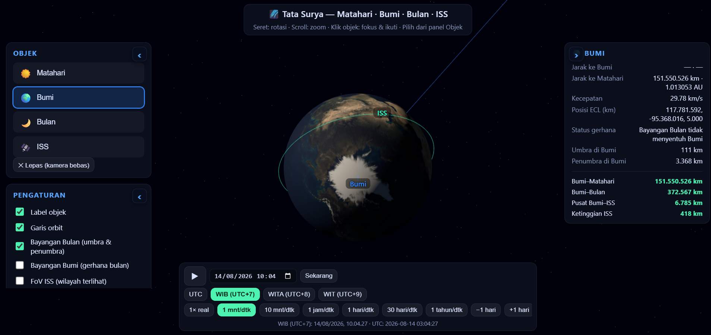
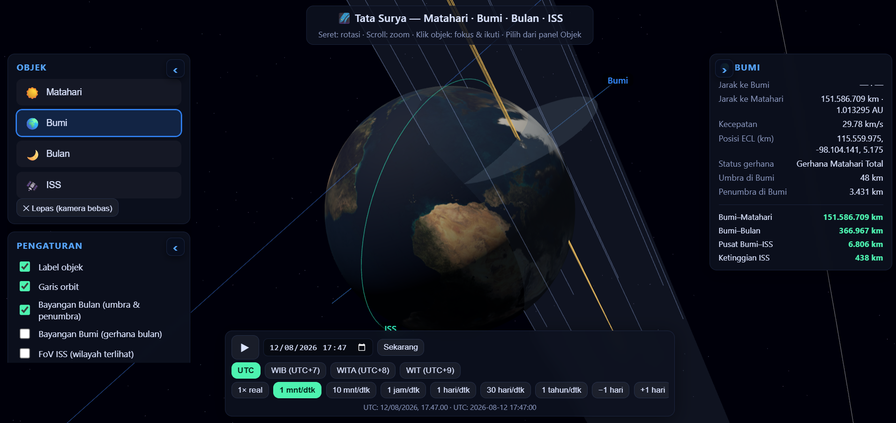

# SunEarthMoonISS Simulator

Simulasi ini dibuat untuk menampilkan posisi relatif objek-objek langit utama di ruang angkasa menggunakan pendekatan numerik dan parameter astronomi yang berbasis data sains bumi bulat. Program ini tidak bergantung pada koneksi internet untuk menjalankan simulasi utama, sehingga dapat dipakai secara offline di komputer lokal.

## Tujuan

Proyek ini bertujuan untuk membantu pengguna memahami:

- posisi relatif Matahari, Bulan, dan Bumi
- pergerakan ISS (International Space Station)
- hubungan antara waktu, sudut, bayangan, dan posisi observasi
- bagaimana parameter astronomi dapat dimodelkan secara numerik

## Fitur utama

- Simulasi posisi dan orientasi Bumi, Bulan, dan Matahari
- Prediksi orbit ISS berdasarkan data sains yang diproses secara lokal
- Perhitungan bayangan, arah pandang, dan sudut matahari
- Dapat dijalankan tanpa akses internet
- Menggunakan parameter numerik dan model matematika yang konsisten dengan pendekatan sains modern

## Prinsip dasar

Simulasi ini menggunakan angka, rumus, dan parameter astronomi yang dibuat berdasarkan model bumi bulat yang umum dipakai dalam ilmu astronomi dan navigasi:

- bentuk Bumi adalah bulat
- parameter rotasi dan revolusi dipertimbangkan secara matematis
- posisi objek dihitung berdasarkan waktu dan koordinat referensi
- model pergerakan dibuat dengan pendekatan ilmiah yang tidak mengandalkan API online

## Jalankan secara offline

Setelah proyek diunduh atau disalin ke komputer, Anda dapat menjalankannya tanpa koneksi internet:

1. Buka folder proyek
2. Pastikan Node.js sudah terpasang
3. Jalankan perintah berikut:

```bash
npm install
npm run dev
```

Atau untuk build produksi:

```bash
npm run build
```

## Screenshot

### Tampilan simulasi 1



### Tampilan simulasi 2 : Gerhana 12 Agustus 2026, umbra, penumbra, lokasi jatuh bayangan



## Bahasa dan teknologi

- React
- TypeScript
- Vite
- Vitest
- Three.js

## Catatan

Dokumen ini dibuat untuk menjelaskan bahwa simulasi ini berbasis pada model ilmiah yang menggunakan bumi bulat dan parameter numerik yang dapat dihitung secara lokal. Dengan demikian, pengguna dapat menjalankan simulasi tanpa bergantung pada layanan online atau koneksi internet.

## Lisensi

Proyek ini dibuat untuk keperluan simulasi edukatif dan penelitian awal. Silakan sesuaikan lisensinya sesuai kebutuhan penggunaan Anda.
